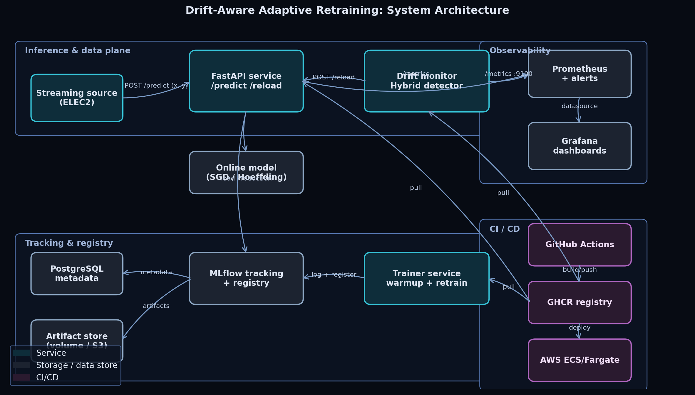

# Drift-Aware Adaptive Retraining for Streaming Classification

End-to-end MLOps reference implementation with a novel hybrid concept-drift
detector. Built for the FAST-NUCES MLOps course project.

| Track | Mandatory components |
|---|---|
| Track-II (Technical: Implementation + Improvement) | MLflow, Docker, Prometheus, Grafana, GitHub Actions CI/CD, AWS-ready |

**Team**

| Member | Roll No |
|---|---|
| Shahmir Asif | 22i-1883 |
| AbuBakr | 22i-1934 |
| Zaid | -- |

---

## What this project is

A streaming classification system in which **monitoring is the experimental
instrument**: drift signals exposed as Prometheus counters drive both the
Grafana dashboards *and* an adaptive-retrain control loop on the inference API.
On top of this pipeline we propose **HybridDD**, a consensus-plus-confidence
drift detector that combines DDM (performance) with KSWIN (distribution).

The full benchmark covers six detectors (ADWIN, DDM, EDDM, KSWIN,
Page-Hinkley, **HybridDD**) × two online learners × three streams (ELEC2 +
SEA + rotating hyperplane) × three seeds, with Friedman--Nemenyi statistical
tests on the results.

## Architecture



Four planes:

- **Inference plane** -- FastAPI service with `/predict`, `/reload`,
  `/metrics`. Online updates via `partial_fit` whenever ground truth is
  attached.
- **Tracking & registry plane** -- MLflow tracking server backed by Postgres,
  artifacts on a Docker volume (or S3 in production).
- **Monitoring & adaptation plane** -- Prometheus scrapes API + drift monitor;
  Grafana renders three dashboards (model performance, drift, infrastructure);
  the drift monitor closes the loop with `POST /reload`.
- **CI/CD plane** -- GitHub Actions: lint, multi-Python pytest, smoke run of
  the experiment driver, Docker build/push to GHCR, optional AWS ECS deploy.

Sequence-level data flow: see [`architecture/dataflow.mmd`](architecture/dataflow.mmd).

## Quickstart (Docker)

```bash
git clone <this-repo>
cd mlops-project
cp .env.example .env

docker compose up -d --build
docker compose logs -f trainer    # wait for warmup training
docker compose logs -f drift_monitor
```

After ~60 s:

| Service | URL |
|---|---|
| Inference API | http://localhost:8000/docs |
| Prometheus | http://localhost:9090 |
| Grafana (admin / admin) | http://localhost:3000 |
| MLflow | http://localhost:5000 |

Sanity check:

```bash
curl -s http://localhost:8000/health | jq
curl -s -X POST http://localhost:8000/predict \
  -H 'Content-Type: application/json' \
  -d '{"features":[1,2,3,4,5,6,7,8],"label":1}' | jq
```

## Local development (no Docker)

```bash
python -m venv .venv && source .venv/bin/activate   # or .venv\Scripts\activate on Windows
pip install -r requirements-dev.txt

make data            # download + preprocess ELEC2
make train           # warmup model + log to MLflow
make experiment      # full benchmark + Friedman-Nemenyi stats
make test            # unit tests with coverage
make serve           # FastAPI on :8000
make drift-service   # drift monitor on :9100
```

> **Python version.** Pin to 3.10--3.12 (the Docker image uses 3.11).
> `river` 0.21 has no wheels for 3.13 yet; if you are on 3.13, use Docker
> or create a 3.11 venv.

## Reproducing the paper results

```bash
# 1) Generate experimental results
python -m src.pipelines.experiment \
  --seeds 42 1337 2024 \
  --models sgd_logistic hoeffding_tree \
  --detectors adwin ddm eddm kswin page_hinkley hybrid \
  --streams elec2 sea hyperplane

# 2) Refresh paper macros from results.csv
python scripts/fill_paper_numbers.py

# 3) Compile the IEEE LaTeX paper
make paper
```

The final PDF is at [`paper/main.pdf`](paper/main.pdf).

## Repository layout

```
mlops-project/
├── src/
│   ├── api/              FastAPI inference service + Prometheus metrics
│   ├── data/             ELEC2 download/preprocess + synthetic streams
│   ├── drift/            Detectors (ADWIN, DDM, EDDM, KSWIN, Page-Hinkley, Hybrid)
│   ├── models/           Online model adapters (SGD, HoeffdingTree, batch LR)
│   ├── monitoring/       Drift monitor service (closes the loop)
│   ├── pipelines/        Train + prequential + experiment harness
│   └── utils/            Config + logging
├── tests/                Pytest suite (drift, models, prequential, API)
├── deploy/
│   ├── docker/           Dockerfiles (api, trainer, drift, mlflow)
│   ├── prometheus/       prometheus.yml + alert rules
│   └── grafana/          Provisioning + 3 dashboards (model, drift, infra)
├── docker-compose.yml    Full stack (postgres+mlflow+trainer+api+drift+prom+grafana)
├── architecture/         Mermaid sources + rendered PNG
├── paper/                IEEE LaTeX paper + bibliography + auto-generated tables
├── scripts/              Helpers (architecture renderer, paper number filler)
├── .github/workflows/    CI / Docker / paper / deploy
├── Makefile              Common tasks
├── pyproject.toml        Tooling config (ruff, mypy, pytest)
├── requirements*.txt     Pinned deps
└── README.md
```

## Drift detector details

All detectors share the contract:

```python
class DriftDetector:
    def update(self, error: int, x: np.ndarray | None = None) -> DriftEvent | None: ...
    def reset(self) -> None: ...
```

`HybridDD` (the contribution of this work) is in
[`src/drift/detectors.py`](src/drift/detectors.py). The decision rule is:

> Emit a hard drift event when (a) DDM and KSWIN both fire within
> `consensus_window=200` steps **OR** (b) DDM enters drift state with rolling
> error rate ≥ `confidence_threshold=0.35`. Cooldown of 500 steps suppresses
> retraining storms.

## Monitoring

Prometheus metrics emitted by the stack:

| Metric | Type | Labels |
|---|---|---|
| `ml_predictions_total` | counter | `predicted_label` |
| `ml_prediction_errors_total` | counter | -- |
| `ml_drift_events_total` | counter | `detector`, `kind` |
| `ml_retrains_total` | counter | `reason` |
| `ml_rolling_accuracy` | gauge | -- |
| `ml_rolling_error_rate` | gauge | -- |
| `ml_drift_severity` | gauge | `detector` |
| `ml_model_version_info` | gauge | `version`, `source` |
| `ml_inference_latency_seconds` | histogram | -- |
| `ml_online_update_latency_seconds` | histogram | -- |

Plus the standard FastAPI request metrics from
`prometheus-fastapi-instrumentator` at `/metrics-fastapi`.

Alert rules in [`deploy/prometheus/alerts.yml`](deploy/prometheus/alerts.yml)
escalate sustained low accuracy and high drift rates.

## CI/CD

| Workflow | Trigger | What it does |
|---|---|---|
| [`ci.yml`](.github/workflows/ci.yml) | push, PR | ruff + mypy, pytest on Python 3.10/3.11/3.12, smoke experiment run |
| [`docker.yml`](.github/workflows/docker.yml) | push to main, tags | Build & push 4 images to GHCR, Trivy scan |
| [`deploy.yml`](.github/workflows/deploy.yml) | manual | Re-tag GHCR -> ECR, force ECS redeploy, smoke `/health` |
| [`paper.yml`](.github/workflows/paper.yml) | paper/** changes | Compile IEEE LaTeX, upload PDF artifact |

## Evaluation rubric mapping

| Criterion | Where it lives |
|---|---|
| Research novelty (20%) | `src/drift/detectors.py` (HybridDD), `paper/main.tex` §IV |
| Technical implementation (25%) | full repo; one-command `docker compose up` |
| Design quality (15%) | architecture diagram, modular factory pattern, typed APIs |
| Monitoring & observability (10%) | Prometheus + Grafana + alert rules + drift loop |
| Experimental rigor (15%) | 36-config benchmark + Friedman-Nemenyi stats |
| Documentation & presentation (15%) | this README + IEEE paper + dashboards |

## License

MIT.
